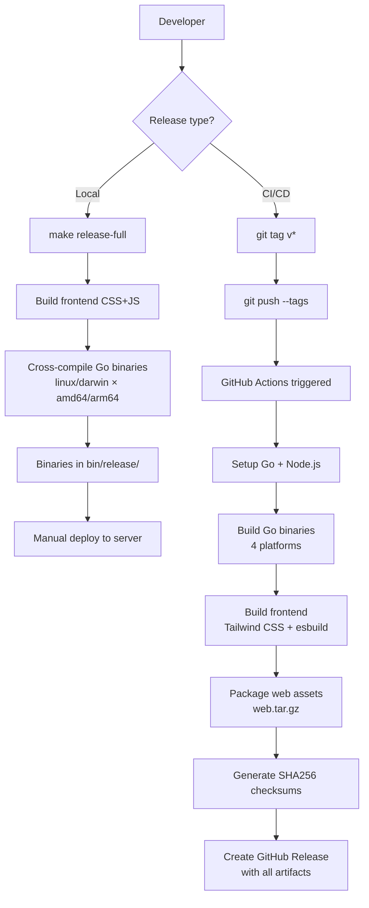
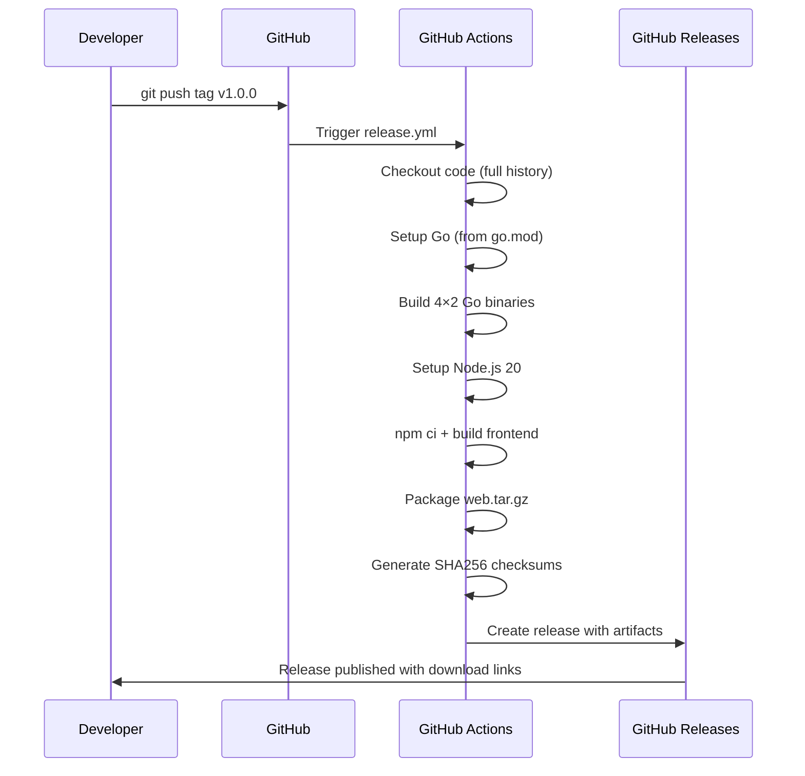

# LinkStash Deployment Guide

## Overview

LinkStash supports two release paths: **local release** (manual cross-compilation) and **CI release** (GitHub Actions, triggered by git tags).

## Release Flow



## Local Release

### Prerequisites

- Go 1.21+
- `tools/tailwindcss` and `tools/esbuild` binaries in the project
- `node_modules/` installed (`npm install`)

### Steps

```bash
# Full release: frontend + cross-compiled binaries
make release-full

# Or separately:
make frontend    # Build CSS + JS
make release     # Cross-compile Go binaries only
```

**Output:** `bin/release/` directory with 8 binaries:

| Binary | OS | Arch |
|--------|----|------|
| `linkstash-server-linux-amd64` | Linux | x86_64 |
| `linkstash-server-linux-arm64` | Linux | ARM64 |
| `linkstash-server-darwin-amd64` | macOS | Intel |
| `linkstash-server-darwin-arm64` | macOS | Apple Silicon |
| `linkstash-linux-amd64` | Linux | x86_64 |
| `linkstash-linux-arm64` | Linux | ARM64 |
| `linkstash-darwin-amd64` | macOS | Intel |
| `linkstash-darwin-arm64` | macOS | Apple Silicon |

### Deploy to server

```bash
# Copy binary + web assets to target
scp bin/release/linkstash-server-linux-amd64 user@server:/opt/linkstash/
scp -r web/templates web/static user@server:/opt/linkstash/web/
scp conf/app_dev.yaml user@server:/opt/linkstash/conf/

# On the server
ssh user@server
cd /opt/linkstash
./linkstash-server -conf conf/app_dev.yaml
```

## CI Release (GitHub Actions)

### Trigger

Push a semver tag to trigger the release workflow:

```bash
git tag v1.0.0
git push origin v1.0.0
```

### Workflow Steps



### What gets published

- 8 Go binaries (server + CLI × 4 platforms)
- `web.tar.gz` — frontend templates and static assets
- `checksums.txt` — SHA256 hashes for verification

### Verifying a release

```bash
# Download and verify
curl -LO https://github.com/<org>/linkstash/releases/download/v1.0.0/linkstash-server-linux-amd64
curl -LO https://github.com/<org>/linkstash/releases/download/v1.0.0/checksums.txt
sha256sum -c checksums.txt --ignore-missing
```

## Version Info

The build injects version and build time via Go ldflags:

```go
// Accessible in the binary:
// main.Version   = git tag (e.g., "v1.0.0") or "dev"
// main.BuildTime = UTC build timestamp
```

Check the running version:

```bash
./linkstash-server -version   # if supported
# Or check at build time:
go version -m ./linkstash-server | grep main.Version
```

## Configuration

The server requires:
- `conf/app_dev.yaml` — application configuration
- `.env` — environment variables (copy from `.env.example`, **gitignored**)
- Auth secret: configured in YAML, default dev value is `clark`

## Quick Reference

| Task | Command |
|------|---------|
| Local full release | `make release-full` |
| Local binaries only | `make release` |
| CI release | `git tag v1.x.x && git push origin v1.x.x` |
| Build + run locally | `make start` |
| Stop local server | `make stop` |
| Run tests first | `make test` |
| Smoke test | `make smoke-test` |
