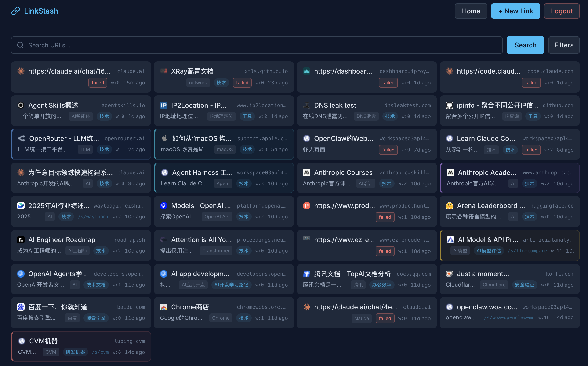

# LinkStash — 个人 URL 资源管理器

LinkStash 是一款面向个人的 URL 资源管理工具，支持 URL 收集、LLM 智能分析、关键词/语义混合检索、短链生成，通过 Web 界面、CLI 工具和 PopClip 插件三种方式交互。



## ✨ 核心功能

| 功能                     | 说明                                                                           |
|------------------------|------------------------------------------------------------------------------|
| **URL 管理**             | 添加、编辑、删除、分页浏览，支持分类 / 标签 / 热度排序                                               |
| **LLM 智能分析**           | 添加 URL 后异步抓取页面（可配置策略链：HTTP / headless Chrome），LLM 自动提取标题、关键词、摘要、分类、标签 |
| **混合检索**               | FTS5 关键词检索 + 512 维向量语义检索 + Bleve 全文索引                                        |
| **短链服务**               | SHA256+Base62 短码生成，302 重定向，支持 TTL 过期（410 Gone）                               |
| **现代深色 Web UI**       | Refined Dark 设计（Slate 色系 + Sky 主色调），Preact SPA，紧凑多列链接网格，可折叠筛选，响应式（1/2/3 列），无限滚动 |
| **CLI 工具**             | `linkstash add / list / search / short / info` 全命令行操作                        |
| **PopClip 插件**         | macOS 上选中 URL 一键保存                                                           |

## 🏗️ 技术栈

```
Go · chi · GORM · SQLite (modernc) · Google Wire · Preact · preact-router · @preact/signals · Tailwind CSS v4 · esbuild · Rod · JWT · cobra
```

## 📦 安装

### 一键服务部署（Linux 服务器）

自动完成用户创建、目录结构、二进制下载、配置生成、systemd 配置：

```bash
curl -fsSL https://raw.githubusercontent.com/lupguo/linkstash/main/INSTALL.sh | sudo bash
```

安装完成后：

```bash
sudo vim /opt/linkstash/.env          # 填入 OPENROUTER_API_KEY
sudo systemctl start linkstash        # 启动服务
curl -s http://127.0.0.1:8085/health  # 验证
```

> 详见 [CVM 部署指南](docs/deploy-cvm.md)（含 Caddy HTTPS 配置）。

### 轻量安装（仅二进制）

```bash
curl -fsSL https://raw.githubusercontent.com/lupguo/linkstash/main/scripts/install.sh | bash
```

可选参数：`--version v0.2.3 --dir /usr/local/bin`

### 从源码构建

```bash
git clone https://github.com/lupguo/linkstash.git
cd linkstash
npm install     # 安装 Preact 前端依赖
make build      # 前端 (CSS+JS) + server + CLI → bin/
```

### GitHub Release

前往 [Releases](https://github.com/lupguo/linkstash/releases) 下载预编译二进制。

支持平台：Linux (amd64/arm64)、macOS (amd64/arm64)。自 v0.4.0 起，前端资源已嵌入二进制，下载即用，无需额外文件。

## 🚀 快速开始

### 1. 配置

```bash
cp conf/app_example.yaml conf/app_dev.yaml
vim conf/app_dev.yaml
```

关键配置：

```yaml
auth:
  secret_key: "your-login-secret"
  jwt_secret: "your-jwt-secret"      # 务必修改

llm:
  chat:
    provider: "openrouter"
    endpoint: "https://openrouter.ai/api/v1/chat/completions"
    api_key: "${OPENROUTER_API_KEY}"  # 环境变量引用
    model: "minimax/minimax-m2.5"
  embedding:
    provider: "openrouter"
    endpoint: "https://openrouter.ai/api/v1/embeddings"
    api_key: "${OPENROUTER_API_KEY}"
    model: "qwen/qwen3-embedding-8b"
    dimensions: 512
```

### URL 抓取策略（Fetcher）

LinkStash 使用可配置的策略链抓取网页内容供 LLM 分析。策略按顺序尝试，前一个失败自动降级到下一个。

```yaml
# 策略链：按顺序尝试，支持 "http"（Go 原生）、"browser"（Rod headless Chrome）、"browser-proxy"（Chrome + 代理）
fetcher:
  strategies: ["http"]              # 低内存服务器推荐仅 HTTP（~50MB）
  # strategies: ["http", "browser"] # HTTP 优先，JS 渲染页面回退到 Chrome（需额外 ~200MB）
  http:
    timeout_sec: 15
    max_content: 51200              # 50KB
    user_agent: "LinkStash/1.0 (+https://github.com/lupguo/linkstash)"
  browser:
    timeout_sec: 30
    max_content: 51200
    lifecycle: "on-demand"          # 每次用完即关 Chrome，空闲时零内存

# 使用 browser 策略时需启用
browser:
  enabled: false                    # 设为 true 并配合 strategies 包含 "browser"
  # bin_path: "/usr/bin/chromium-browser"  # 留空则自动下载
  headless: true
  timeout_sec: 30
```

| 策略 | 内存占用 | 适用场景 |
|------|---------|---------|
| `["http"]` | ~50MB | 低内存服务器（≤2GB），大多数静态页面 |
| `["http", "browser"]` | ~50MB 空闲 / ~250MB 分析中 | 需解析 JS 渲染页面（SPA、Cloudflare 保护） |
| `["http", "browser", "browser-proxy"]` | 同上 | 额外需要代理翻墙的站点 |

### 2. 启动

```bash
make start        # 后台启动（端口 8888）
make stop         # 停止
make restart      # 重启
make run          # 前台运行（调试用）
```

### 3. 查看版本

```bash
linkstash-server --version    # 查看服务端版本
linkstash --version           # 查看 CLI 版本
```

### 4. 使用 CLI

```bash
export LINKSTASH_SERVER=http://localhost:8888
export LINKSTASH_TOKEN=$(curl -s -X POST http://localhost:8888/api/auth/token \
  -H "Content-Type: application/json" \
  -d '{"secret_key":"your-login-secret"}' | grep -o '"token":"[^"]*"' | cut -d'"' -f4)

linkstash add https://github.com
linkstash list
linkstash search "GitHub" --type keyword
linkstash short https://example.com/long-path --ttl 7d
```

## 🌐 Caddy 反向代理 + HTTPS

服务部署后监听 `127.0.0.1:8085`，通过 Caddy 对外提供 HTTPS：

### 安装 Caddy

```bash
# RHEL 系 (RockyLinux/AlmaLinux/CentOS)
sudo dnf install -y 'dnf-command(copr)'
sudo dnf copr enable -y @caddy/caddy
sudo dnf install -y caddy

# 或直接下载二进制
sudo curl -fsSL "https://caddyserver.com/api/download?os=linux&arch=amd64" -o /usr/bin/caddy
sudo chmod +x /usr/bin/caddy
```

### 配置 Caddyfile

```bash
sudo vim /etc/caddy/Caddyfile
```

```caddyfile
your-domain.example.com {
    reverse_proxy 127.0.0.1:8085
    encode gzip zstd

    log {
        output file /var/log/caddy/linkstash.log
        format json
    }
}
```

> Caddy 自动申请 Let's Encrypt 证书，自动处理 HTTP → HTTPS 重定向。

### 启动 Caddy

```bash
sudo mkdir -p /var/log/caddy && sudo chown caddy:caddy /var/log/caddy
sudo systemctl enable --now caddy
```

### 防火墙

```bash
sudo firewall-cmd --permanent --add-service=http
sudo firewall-cmd --permanent --add-service=https
sudo firewall-cmd --reload
```

> 云服务器还需在控制台安全组中开放 80/443 端口。

## 📡 REST API

### 鉴权

```
POST /api/auth/token               # secret_key 换 JWT
```

### URL 管理

```
POST   /api/urls                   # 添加 URL（触发异步 LLM 分析）
GET    /api/urls                   # 列表（?page=1&size=20&sort=time&category=&tags=）
GET    /api/urls/:id               # 详情
PUT    /api/urls/:id               # 更新（支持 partial update）
DELETE /api/urls/:id               # 软删除
POST   /api/urls/:id/visit         # 记录访问
POST   /api/urls/:id/reanalyze    # 重新 LLM 分析
```

### 检索

```
GET    /api/search?q=<query>&type=keyword|semantic|hybrid&page=1&size=20
```

### 短链

```
POST   /api/short-links            # 创建短链（{"long_url":"...", "ttl":"7d"}）
GET    /api/short-links            # 短链列表
PUT    /api/short-links/:id        # 更新
DELETE /api/short-links/:id        # 删除
GET    /s/:code                    # 302 重定向（无需鉴权）
```

### Web 页面（SPA）

```
GET    /                           # Preact SPA 入口（客户端路由）
GET    /login                      # 登录页（SPA 路由）
GET    /urls/new                   # 新建 URL（SPA 路由）
GET    /urls/:id                   # 详情页（SPA 路由）
```

> 所有非 API、非静态资源的路径均返回 spa.html，由 Preact 客户端路由处理。

## 🗄️ 数据库配置

LinkStash 支持 **SQLite**（默认）和 **MySQL** 两种数据库后端，通过 `database.driver` 字段切换。

### SQLite（默认）

零配置，适合开发和轻量部署：

```yaml
database:
  driver: sqlite
  sqlite:
    path: "./data/linkstash.db"
```

### MySQL

适合生产环境，利用已有的 MySQL 备份体系保障数据安全：

```yaml
database:
  driver: mysql
  mysql:
    user: root
    password: "${MYSQL_PASSWORD}"   # 支持环境变量引用
    host: 127.0.0.1
    port: 3306
    dbname: linkstash_db
    charset: utf8mb4
    max_open_conns: 25
    max_idle_conns: 5
```

> **注意**：SQLite 模式使用 FTS5 进行关键词检索；MySQL 模式使用 LIKE 查询（个人项目数据量下性能足够）。语义向量检索两种模式均为内存缓存 + BLOB 存储，行为一致。

### 数据迁移（SQLite → MySQL）

使用 CLI 工具将 SQLite 数据导出到 MySQL：

```bash
# 方式一：使用独立参数
linkstash migrate \
  --sqlite-path ./data/linkstash.db \
  --mysql-user root --mysql-password YOUR_DB_PASSWORD \
  --mysql-host 127.0.0.1 --mysql-port 3306 --mysql-db linkstash_db

# 方式二：使用 DSN 字符串
linkstash migrate \
  --sqlite-path ./data/linkstash.db \
  --mysql-dsn "root:YOUR_DB_PASSWORD@tcp(127.0.0.1:3306)/linkstash_db?charset=utf8mb4&parseTime=True&loc=Local"
```

迁移过程：

1. 自动在 MySQL 中创建/验证表结构（AutoMigrate）
2. 按表逐批导入：`t_urls` → `t_embeddings` → `t_visit_records` → `t_llm_logs`
3. 完成后输出每张表的迁移记录数

> ⚠️ 迁移前请确保 MySQL 目标数据库已创建（`CREATE DATABASE linkstash_db CHARACTER SET utf8mb4;`）。

## 🔨 Makefile

```bash
make build          # 前端 + server + CLI
make frontend       # CSS + JS
make dev-frontend   # 前端 watch 模式
make start / stop   # 后台启动 / 停止
make test           # Go 单元测试
make smoke-test     # 冒烟测试
make wire           # 重新生成 Wire DI 代码
make release        # 交叉编译全平台
make lint           # golangci-lint
make fmt            # gofmt
make clean          # 清理构建产物
```

## 📁 项目结构

```
linkstash/
├── cmd/
│   ├── server/main.go              # 服务端入口（chi 路由 + 优雅关闭）
│   └── cli/                        # CLI 工具 (cobra)
├── app/
│   ├── di/                         # Google Wire 依赖注入
│   ├── handler/                    # HTTP Handler（REST API + Web 页面）
│   ├── middleware/                  # JWT 鉴权中间件
│   ├── application/                # 用例层（url, search, analysis）
│   ├── domain/
│   │   ├── entity/                 # 领域实体
│   │   ├── services/               # 领域服务
│   │   └── repos/                  # 仓储接口
│   └── infra/
│       ├── db/                     # GORM 仓储实现
│       ├── llm/                    # OpenRouter/OpenAI 兼容 LLM 客户端
│       ├── browser/                # Rod headless Chrome 页面抓取
│       ├── search/                 # Bleve 全文 + 向量检索
│       ├── config/                 # YAML 配置加载
│       └── logger/                 # slog 日志
├── web/
│   ├── embed.go                      # go:embed 静态资源嵌入
│   ├── templates/spa.html             # SPA 入口 HTML
│   ├── src/js/                        # Preact SPA 源码
│   │   ├── app.jsx                    # 入口（Router + Layout）
│   │   ├── api.js                     # JSON API 客户端
│   │   ├── store.js                   # Signals 状态管理
│   │   ├── utils.js                   # 工具函数
│   │   ├── pages/                     # 页面组件（Login, Index, Detail）
│   │   └── components/                # 共享组件（Layout, URLCard, SearchBar 等）
│   └── src/css/                       # Tailwind CSS 入口
├── INSTALL.sh                      # 一键服务部署脚本
├── scripts/
│   ├── install.sh                  # 轻量二进制安装
│   └── smoke_test.sh               # 冒烟测试
├── conf/app_example.yaml           # 配置模板
├── .github/workflows/release.yml   # GitHub Actions 自动发布
└── Makefile
```

**调用链**：`handler → application → domain service → repo (interface) ← infra (实现)`

## 🏷️ 发布新版本

```bash
git tag v0.2.3 -m "Release description"
git push origin v0.2.3
```

GitHub Actions 自动：构建前端 → 嵌入资源 → 交叉编译 8 个二进制 → 创建 Release。

## License

MIT
