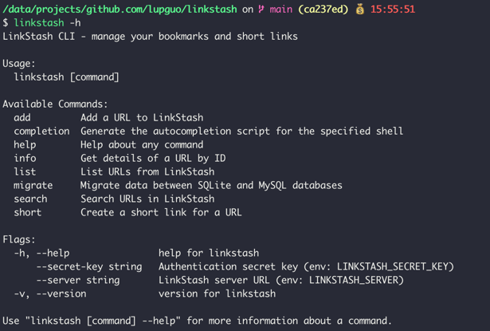
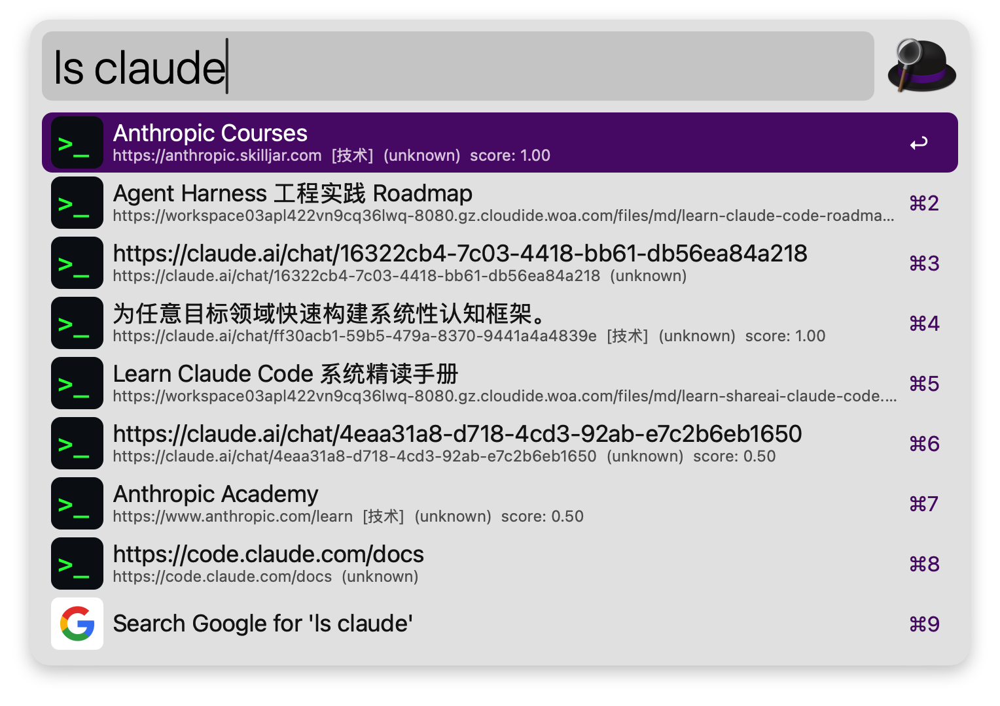
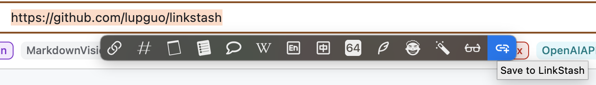

# LinkStash — 个人 URL 资源管理器

LinkStash 是一款面向个人的 URL 资源管理工具，支持 URL 收集、LLM 智能分析、关键词/语义混合检索、短链生成，通过 Web 界面、CLI 工具、Alfred Workflow 和 PopClip 插件多种方式交互。


## ✨ 核心功能

| 功能                     | 说明                                                                           |
|------------------------|------------------------------------------------------------------------------|
| **URL 管理**             | 添加、编辑、删除、分页浏览，支持分类 / 标签 / 热度排序                                               |
| **LLM 智能分析**           | 添加 URL 后异步抓取页面（可配置策略链：HTTP / headless Chrome），LLM 自动提取标题、关键词、摘要、分类、标签 |
| **混合检索**               | FTS5 关键词检索 + 512 维向量语义检索 + Bleve 全文索引                                        |
| **短链服务**               | SHA256+Base62 短码生成，302 重定向，支持 TTL 过期（410 Gone）                               |
| **可书签化搜索 URL**       | 搜索状态双向同步到 URL，支持 `?q=claude&category=技术` 参数直接访问 |
| **现代深色 Web UI**       | Refined Dark 设计（Slate 色系 + Sky 主色调），Preact SPA，紧凑多列链接网格，可折叠筛选，响应式布局，无限滚动 |

## 🖥️ 多端交互

### CLI 命令行工具

全功能命令行客户端，支持 `add / list / search / short / info / migrate` 等操作。



```bash
export LINKSTASH_SERVER=http://localhost:8888
export LINKSTASH_SECRET_KEY=your-secret

linkstash add https://github.com
linkstash list
linkstash search "GitHub" --type keyword
linkstash short https://example.com/long-path --ttl 7d
```

### Alfred Workflow（macOS）

在 Alfred 中快速搜索书签，无需打开浏览器。



- **`ls {query}`** — 在 Alfred 中搜索并展示结果（Enter 打开、⌘ 复制、⌥ 详情页）
- **`lsweb {query}`** — 在浏览器中打开 LinkStash 搜索页

安装：导入 `extend_plugins/alfred/LinkStash.alfredworkflow/`，设置 `LINKSTASH_SERVER` 和 `LINKSTASH_SECRET_KEY`。

### PopClip 插件（macOS）

选中 URL 文本后一键保存到 LinkStash。



安装：双击 `extend_plugins/popclip/LinkStash.popclipext/` 导入。

## 🏗️ 技术栈

```
Go · chi · GORM · SQLite (modernc) · Google Wire · Preact · preact-router · @preact/signals · Tailwind CSS v4 · esbuild · Rod · JWT · cobra
```

## 📦 安装

### 一键服务部署（Linux 服务器）

```bash
curl -fsSL https://raw.githubusercontent.com/lupguo/linkstash/main/INSTALL.sh | sudo bash
```

安装完成后：

```bash
sudo vim /opt/linkstash/.env          # 填入 OPENROUTER_API_KEY
sudo systemctl start linkstash        # 启动服务
curl -s http://127.0.0.1:8085/health  # 验证
```

### 从源码构建

```bash
git clone https://github.com/lupguo/linkstash.git
cd linkstash
npm install     # 安装 Preact 前端依赖
make build      # 前端 (CSS+JS) + server + CLI → bin/
```

### GitHub Release

前往 [Releases](https://github.com/lupguo/linkstash/releases) 下载预编译二进制。

支持平台：Linux (amd64/arm64)、macOS (amd64/arm64)。自 v0.4.0 起，前端资源已嵌入二进制，下载即用。

> 详细部署说明见 [DEPLOYMENT.md](DEPLOYMENT.md)（含 Docker、Systemd、Caddy HTTPS、数据备份等）。

## 🚀 快速开始

### 1. 配置

```bash
cp conf/app_example.yaml conf/app_dev.yaml
cp .env.example .env
vim .env    # 填入 OPENROUTER_API_KEY
```

关键配置：

```yaml
auth:
  secret_key: "your-login-secret"
  jwt_secret: "your-jwt-secret"

llm:
  chat:
    provider: "openrouter"
    endpoint: "https://openrouter.ai/api/v1/chat/completions"
    api_key: "${OPENROUTER_API_KEY}"
    model: "minimax/minimax-m2.5"
  embedding:
    provider: "openrouter"
    endpoint: "https://openrouter.ai/api/v1/embeddings"
    api_key: "${OPENROUTER_API_KEY}"
    model: "qwen/qwen3-embedding-8b"
    dimensions: 512
```

### 2. 启动

```bash
make start        # 后台启动（端口 8888）
make stop         # 停止
make restart      # 重启
```

### 3. 版本信息

```bash
linkstash-server --version
linkstash --version
```

## 📡 REST API

### 鉴权

```
POST /api/auth/token               # secret_key 换 JWT
```

### URL 管理

```
POST   /api/urls                   # 添加 URL（触发异步 LLM 分析）
GET    /api/urls                   # 列表（?page=1&size=20&sort=time&category=）
GET    /api/urls/:id               # 详情
PUT    /api/urls/:id               # 更新
DELETE /api/urls/:id               # 软删除
POST   /api/urls/:id/visit         # 记录访问
POST   /api/urls/:id/reanalyze    # 重新 LLM 分析
```

### 检索

```
GET /api/search?q=<query>&type=keyword|semantic|hybrid&page=1&size=20
```

### 短链

```
POST   /api/short-links            # 创建短链
GET    /api/short-links            # 短链列表
GET    /s/:code                    # 302 重定向（无需鉴权）
```

### 可书签化搜索

```
GET /?q=claude&type=semantic&category=技术    # 搜索参数自动回填
```

## 🗄️ 数据库

支持 **SQLite**（默认）和 **MySQL**，通过 `database.driver` 切换。

```yaml
# SQLite（零配置）
database:
  driver: sqlite
  sqlite:
    path: "./data/linkstash.db"

# MySQL
database:
  driver: mysql
  mysql:
    user: root
    password: "${MYSQL_PASSWORD}"
    host: 127.0.0.1
    port: 3306
    dbname: linkstash_db
```

数据迁移：`linkstash migrate --sqlite-path ./data/linkstash.db --mysql-dsn "..."`

## 🔨 Makefile

```bash
make build          # 前端 + server + CLI
make frontend       # CSS + JS（自动 hash cache busting）
make dev-frontend   # 前端 watch 模式
make start / stop   # 后台启动 / 停止
make test           # Go 单元测试
make smoke-test     # 冒烟测试
make wire           # 重新生成 Wire DI 代码
make release-full   # 交叉编译全平台 + 前端
make lint / fmt     # 代码检查 / 格式化
```

## 📁 项目结构

```
linkstash/
├── cmd/
│   ├── server/main.go              # 服务端入口（chi 路由 + 优雅关闭）
│   └── cli/                        # CLI 工具 (cobra)
├── app/
│   ├── di/                         # Google Wire 依赖注入
│   ├── handler/                    # HTTP Handler（REST API + Web 页面）
│   ├── middleware/                  # JWT 鉴权中间件
│   ├── application/                # 用例层（url, search, analysis）
│   ├── domain/                     # 领域层（entity, services, repos）
│   └── infra/                      # 基础设施（db, llm, browser, search, config）
├── web/
│   ├── embed.go                    # go:embed 静态资源嵌入
│   ├── templates/spa.html.tmpl     # SPA 模板（构建时注入 hash）
│   ├── src/js/                     # Preact SPA 源码
│   └── src/css/                    # Tailwind CSS 入口
├── extend_plugins/
│   ├── alfred/                     # Alfred Workflow
│   └── popclip/                    # PopClip 插件
├── INSTALL.sh                      # 一键服务部署脚本
├── DEPLOYMENT.md                   # 完整部署指南
└── Makefile
```

**调用链**：`handler → application → domain service → repo (interface) ← infra (实现)`

## 🏷️ 发布新版本

```bash
git tag v0.7.0 -m "Release description"
git push origin v0.7.0
```

GitHub Actions 自动：构建前端 → 嵌入资源 → 交叉编译 8 个二进制 → 创建 Release。

## License

MIT
