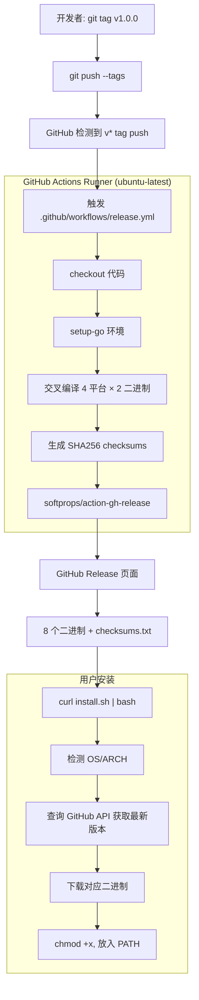
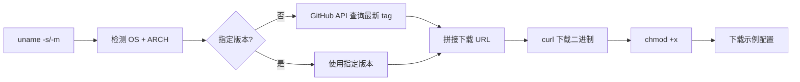

# GitHub Actions + Release 发布体系：从 git tag 到 curl 一键安装

## 核心问题与价值

**痛点**：Go 项目编译后是单个二进制文件，但手动为多平台（linux/darwin × amd64/arm64）交叉编译、上传到 GitHub、生成 changelog 是重复劳动。用户安装时还要手动判断自己的 OS/架构去下载对应文件。

**核心价值**：`git tag v1.0.0 && git push --tags` 一条命令触发全自动流水线 — 编译 → 校验 → 发布 → 用户 `curl | bash` 一键安装。**开发者零手动操作，用户零认知负担。**

## 系统解构图

### 完整发布流程



### 三个关键概念

#### 1. GitHub Actions Workflow（`.github/workflows/release.yml`）

GitHub Actions 是 GitHub 内置的 CI/CD 系统。Workflow 文件定义**何时触发**和**做什么**：

```yaml
on:
  push:
    tags:
      - 'v*'    # 只在推送 v 开头的 tag 时触发
```

它与 Makefile 的关系：**互补但独立**。

| | Makefile `make release` | GitHub Actions `release.yml` |
|---|---|---|
| 运行环境 | 你的本机 | GitHub 云端 Ubuntu 机器 |
| 触发方式 | 手动执行 `make release` | 自动（git push tag 触发） |
| 产物位置 | 本地 `bin/release/` 目录 | GitHub Release 页面（公开下载） |
| 用途 | 本地调试、CVM 手动部署 | 正式发布，用户可下载 |

**`make release` 不会发布到 GitHub** — 它只在本地编译。发布到 GitHub 是 Actions 自动完成的。

#### 2. GitHub Release（制品分发机制）

GitHub Release 是绑定在 git tag 上的**制品发布页面**。它提供：
- 稳定的下载 URL 格式：`https://github.com/{owner}/{repo}/releases/download/{tag}/{filename}`
- 自动生成的 changelog（基于 commit 历史）
- 校验和文件（checksums.txt）

LinkStash 的 Release 产物：

```
dist/
├── linkstash-server-linux-amd64      # Linux x86_64 服务端
├── linkstash-server-linux-arm64      # Linux ARM64 服务端
├── linkstash-server-darwin-amd64     # macOS Intel 服务端
├── linkstash-server-darwin-arm64     # macOS Apple Silicon 服务端
├── linkstash-linux-amd64             # Linux x86_64 CLI
├── linkstash-linux-arm64             # Linux ARM64 CLI
├── linkstash-darwin-amd64            # macOS Intel CLI
├── linkstash-darwin-arm64            # macOS Apple Silicon CLI
└── checksums.txt                     # SHA256 校验和
```

#### 3. curl 一键安装脚本（`scripts/install.sh`）

这是一个 shell 脚本，用户通过 `curl | bash` 执行。它的核心逻辑：



关键设计：URL 格式是**可预测的**。只要知道版本号和平台，就能拼出下载链接：

```
https://github.com/lupguo/linkstash/releases/download/v1.0.0/linkstash-server-linux-amd64
```

这就是为什么 `curl` 安装能工作 — 不需要查询数据库，URL 本身就是寻址方式。

## LinkStash 的实际发布流程

### 发布新版本（完整步骤）

```bash
# 1. 确保 main 分支代码就绪
git checkout main
make test            # 跑测试
make build           # 本地验证编译

# 2. 打 tag
git tag v0.2.0 -m "Release v0.2.0: HTMX infinite scroll"
git push origin v0.2.0

# 3. 自动触发 — 等 2-3 分钟
# GitHub Actions 自动执行 release.yml:
#   编译 8 个二进制 → 生成 checksums → 创建 Release 页面

# 4. 验证
# 浏览器打开 https://github.com/lupguo/linkstash/releases
# 或用 CLI：
gh release view v0.2.0
```

### 用户安装

```bash
# 一键安装（自动检测最新版本 + 当前平台）
curl -fsSL https://raw.githubusercontent.com/lupguo/linkstash/main/scripts/install.sh | bash

# 指定版本和安装目录
curl -fsSL https://raw.githubusercontent.com/lupguo/linkstash/main/scripts/install.sh \
  | bash -s -- --version v0.2.0 --dir /usr/local/bin
```

### 当前 Workflow 解读

```yaml
# .github/workflows/release.yml — 逐行解读

name: Release

on:
  push:
    tags:
      - 'v*'                    # 触发条件：推送 v 开头的 tag

permissions:
  contents: write                # 需要写权限来创建 Release

jobs:
  release:
    runs-on: ubuntu-latest       # 在 GitHub 提供的 Ubuntu 机器上运行
    steps:
      - uses: actions/checkout@v4
        with:
          fetch-depth: 0         # 完整 clone（生成 changelog 需要历史）

      - uses: actions/setup-go@v5
        with:
          go-version: '1.21'     # ⚠️ 注意：项目实际用 Go 1.25，应该更新

      - name: Build release binaries
        run: |
          # 与 Makefile 的 `make release` 逻辑相同
          # 循环 4 个平台，每个平台编译 server + CLI
          VERSION=${GITHUB_REF_NAME}  # 自动获取 tag 名（如 v0.2.0）
          ...
          CGO_ENABLED=0 GOOS=$GOOS GOARCH=$GOARCH go build ...

      - name: Generate checksums
        run: |
          cd dist
          sha256sum * > checksums.txt   # 安全校验

      - name: Create GitHub Release
        uses: softprops/action-gh-release@v2
        with:
          generate_release_notes: true  # 自动生成 changelog
          files: dist/*                 # 上传所有编译产物
```

## 学习路径

### 阶段 1：能用（1 小时）

**聚焦**：理解 tag → Actions → Release 的触发链路

- 读懂你项目的 `release.yml`（就上面这 50 行）
- 实操：`git tag v0.0.1-test && git push origin v0.0.1-test`，观察 Actions 页面
- 理解 Release 页面的 URL 规律

**资源**：[GitHub Actions Quickstart](https://docs.github.com/en/actions/quickstart)

### 阶段 2：会改（2-3 小时）

**聚焦**：定制 Workflow、写安装脚本

- 学习 Workflow 语法：`on`、`jobs`、`steps`、`uses`、`run`、`with`
- 学习 `actions/checkout`、`actions/setup-go`、`softprops/action-gh-release` 这三个核心 Action
- 理解 `GITHUB_REF_NAME`、`GITHUB_TOKEN` 等内置变量
- 写/改 `install.sh` 脚本（OS 检测、版本查询、错误处理）

**资源**：[Workflow syntax reference](https://docs.github.com/en/actions/using-workflows/workflow-syntax-for-github-actions)

### 阶段 3：精通（持续）

**聚焦**：完整 CI/CD 流水线

- 添加 CI workflow（push/PR 触发 lint + test）
- Matrix builds（多 Go 版本 × 多平台并行编译）
- Docker 镜像构建 + 推送到 GHCR
- GoReleaser 替代手写编译脚本
- 签名（cosign / GPG）+ SLSA provenance
- 自建 Homebrew tap（`brew install lupguo/tap/linkstash`）

**资源**：[GoReleaser](https://goreleaser.com/), [SLSA](https://slsa.dev/)

## 关键 Takeaways

1. **`make release` ≠ 发布**。Makefile 在本地编译，GitHub Actions 在云端编译并发布。两者逻辑相同但运行环境不同。

2. **Tag 是发布的触发器**。不是 commit，不是 branch，而是 `git tag v*` + `git push --tags`。没有 tag 推送，workflow 不会运行。

3. **curl 安装的本质是可预测的 URL**。`https://github.com/{owner}/{repo}/releases/download/{tag}/{binary-name}` 这个 URL 模式是固定的，安装脚本只需要拼接 OS/ARCH/VERSION 就能定位到正确的二进制。

4. **Go 的交叉编译是这一切的基础**。`GOOS=linux GOARCH=arm64 go build` 在任何平台上都能编译出目标平台的二进制，不需要目标机器参与。Go 的静态链接（`CGO_ENABLED=0`）确保二进制无外部依赖。

5. **Checksums 是信任链的一环**。`sha256sum` 生成校验和，用户下载后可以验证文件完整性。虽然安装脚本没有自动校验（可以改进），但 checksums.txt 提供了手动验证的能力。

## 深度认知与降噪

### 1. [Understanding GitHub Actions](https://docs.github.com/en/actions/learn-github-actions/understanding-github-actions)

GitHub 官方概念文档。理解 Runner、Job、Step、Action 四层抽象后，所有 workflow 都能看懂。**先读这篇，再读 syntax reference**。

### 2. [GoReleaser — Release Go projects as fast and easily as possible](https://goreleaser.com/)

当手写 workflow 变得复杂时（签名、Docker、Homebrew、changelog 定制），GoReleaser 是 Go 生态的标准答案。一个 `.goreleaser.yaml` 替代你的整个 release workflow + Makefile release target。

### 3. [The Update Framework (TUF) 规范](https://theupdateframework.io/)

理解软件分发安全的系统性思考。为什么 checksums 不够？为什么需要签名？为什么 `curl | bash` 有争议？这个框架回答了所有问题。

## 未来趋势

### 1. 签名成为标配

GitHub 已推出 [Artifact Attestations](https://github.blog/2024-05-02-introducing-artifact-attestations/)（基于 Sigstore），未来 Release 二进制会自带可验证的来源证明。`cosign verify` 将像 `sha256sum --check` 一样普及。

### 2. 容器化发布并行二进制发布

越来越多的 Go 项目同时发布二进制 + Docker 镜像（推送到 GHCR `ghcr.io/owner/repo`）。CVM 部署可以直接 `docker pull` 而非下载二进制 + 手动管理 systemd。

### 3. Homebrew/APT/RPM 包管理集成

通过 GoReleaser 或 GitHub Actions 自动维护 Homebrew tap、APT repo、RPM spec，用户直接 `brew install`、`apt install`，获得自动更新能力。`curl | bash` 会逐渐退化为 fallback 方案。

## 知识盲点

### `softprops/action-gh-release` 不是 GitHub 官方维护的

这是社区 Action，虽然使用量最大但不是 GitHub 官方产品。GitHub 官方的替代是 `gh release create` CLI 命令。如果对供应链安全敏感，可以改为：

```yaml
- name: Create Release
  run: gh release create ${{ github.ref_name }} dist/* --generate-notes
  env:
    GH_TOKEN: ${{ secrets.GITHUB_TOKEN }}
```

### Go 版本不一致

当前 `release.yml` 使用 `go-version: '1.21'`，但 `go.mod` 声明 `go 1.25.0`。这意味着 **CI 编译用的 Go 版本比开发环境低 4 个大版本**。如果代码用了 1.25 的新特性（如 `range over func`），CI 构建会失败。应更新 workflow：

```yaml
- uses: actions/setup-go@v5
  with:
    go-version-file: 'go.mod'  # 自动读取 go.mod 中的版本
```

### `curl | bash` 的安全风险

这种安装方式有一个根本问题：用户无法在执行前审查脚本。中间人攻击、DNS 污染、或 GitHub raw 服务器被入侵都可能导致执行恶意代码。更安全的做法：

```bash
# 先下载，审查，再执行
curl -fsSL https://raw.githubusercontent.com/lupguo/linkstash/main/scripts/install.sh -o install.sh
cat install.sh  # 审查
bash install.sh
```

### GitHub Actions 免费额度

公开仓库 Actions 完全免费。私有仓库每月 2000 分钟（Free plan）。Go 交叉编译通常 2-3 分钟，所以即使私有仓库也远远够用。但如果加上 Docker build + 集成测试，时间会显著增加。

### Release 制品有大小限制

单个 Release 制品最大 2GB，总大小不限。Go 二进制通常 10-30MB（加 `-s -w` 后），所以不会遇到限制。但如果打包了前端资源或容器镜像，需要注意。
